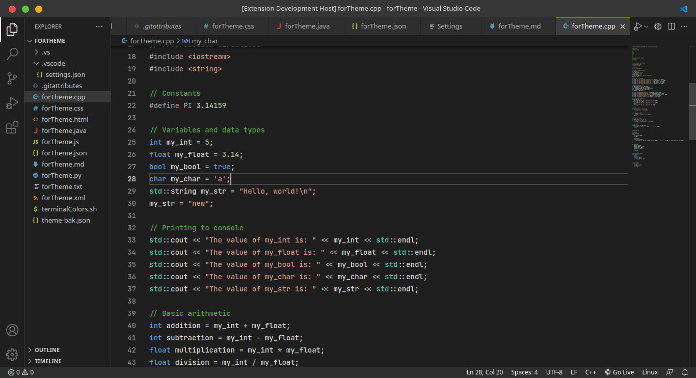
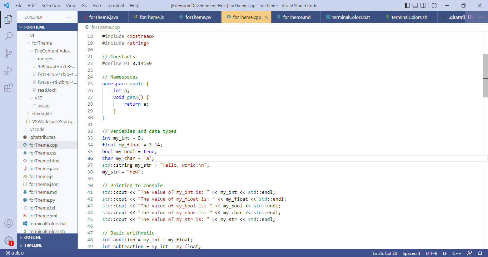

# Visual Studio default themes

Visual Studio default themes contain two basic themes, Dark and Blue.

## Supported Languages

* HTML - CSS - JS
* C++
* JAVA - XML
* Python
---

## Applying theme

### To apply theme:
* Ctrl+Shift+P -> Preferences: Color Theme -> Dark (Visual Studio 2022)
* Ctrl+Shift+P -> Preferences: Color Theme -> Blue (Visual Studio 2022)
---

## Preview

* Dark (Visual Studio 2022)

 
---

* Blue (Visual Studio 2022)

 
---

**Enjoy!**

<a target="_blank" href="https://icons8.com/icon/121602/visual-studio">Visual Studio</a> icon by <a target="_blank" href="https://icons8.com">Icons8</a>
